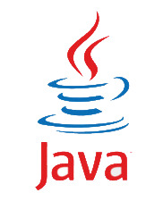
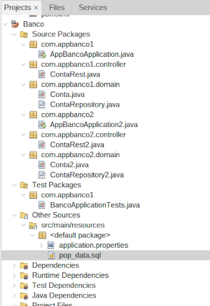

# CRUD-Java-com-SpringBoot

### Sobre:
Este projeto JAVA é uma Simulação de conta Bancária, considerando apenas as funções de Deposito e Saque.

### Objetivo: 
Simular o acesso concorrente ao banco de dados demonstrando as diferenças entre os tratamentos Sem Lock e Lock Otimista. 
No projeto Banco 1 não é aplicado tratamento de bloqueio(sem Lock), já no projeto Banco 2 é aplicado o tratamento Lock Otimista, onde é utilizada a anotação @Version no projeto Spring e acrescentada na tabela do DB o campo "versão". Desta forma a cada alteração do registro é adicionado automaticamente dados de versionamento, como data e hora, ao campo versão.

### Tecnologias utilizadas:
1. Java com Spring Boot
2. Banco H2
3. Jmetter para testar acesso concorrente

### Descrição:
1. Java com Spring Boot:
   
O projeto JAVA é uma Simulação de 2 instituições financeiras (Bancos 1 e 2), considerando apenas as funções de Deposito e Saque. Com a organização de pastas:

2. Banco H2:

O banco de dados possui duas tabelas: Conta e Conta2. Que representam os Bancos 1 e 2 respectivamente e considerando o trataemento de acesso concorrente, temos:

Conta (Banco1) - sem lock
| ID | NOME_CLIENTE | SALDO |
|-------:|-------:|------:|

Conta2 (Banco2) - Lock Otimista
| ID | NOME_CLIENTE | SALDO | Version |
|-------:|-------:|------:|------:|

**OBS: O arquivo pop_data.sql possui os scripts para criação das tabelas Conta e Conta2.**
**Atenção para substituir o spring.datasource.url do DB no arquivo application.properties**

## 3. Jmetter para testar acesso concorrente:
   
A ferramenta Jmetter foi utilizada para testes de várias solicitações de acesso ao banco ao mesmo tempo, com o objetivo de simular o acesso concorrente e verificar as diferenças de comportamento no Banco1 - sem lock e no Banco2 - Lock Otimista. Para esse teste escolhemos fazer 100 requisições de saque ao Banco 1, com valor de R$ 1,00 em uma conta que eu havia setado anteriormente o saldo de R$100,00. De mesmo modo, repeti a operação para uma conta da tabela Conta2, que representa o Banco2.

**OBS: O arquivo jmeter com o teste feito está em retirada.jmx**

### Melhorias Futuras:

Fazer page para entrada e recuparação de dados, com JS e CSS considenrando UX e UI.
Fazer o restante das operações bancárias básicas.

###  Autores

 [Flávia Campos](https://github.com/Fncampos)
 [Israel Costa](https://github.com/israel1608)

  Este projeto é parte de uma atividade acadêmica do Curso Tecnologia em Análise e Desenvolvimentode Sistemas - IFPA - 3º semestre - matéria Sistemas distribuidos, ministrada pelo Profº Cláudio Martins
Israel Costa e Flávia Campos

Este projeto é parte de uma atividade acadêmica do Curso Tecnologia em Análise e Desenvolvimentode Sistemas - IFPA - 4º semestre - Disciplina aplicação de Bancos de Dados, ministrada pelo Profº Cláudio Martins

